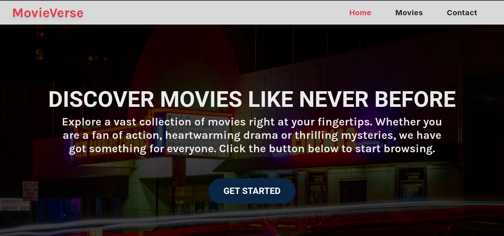

# 🎬 Movie Verse

## ✨ Introduction

Welcome to MovieVerse, a platform that allows you to explore a vast collection of movies with ease. Whether you're into action, drama, or thrilling mysteries, there's something for everyone. This app fetches movie data using the OMDB API and provides detailed movie information, including ratings, genres, and plots.

## 🖼️ Screenshot


[View live site](https://movie-verse-a20.netlify.app)

## 🔑 Key Features

- **Movie Discovery:** Browse a diverse selection of movies.
- **Search Functionality:** Easily search for movies by name.
- **Movie Details:** Get in-depth information about each movie.
- **User-Friendly Interface:** A sleek and intuitive design.
- **Contact Form:** Reach out for inquiries or feedback.

## 🔨 How I Built It

This application was developed using:

- **React** for building user interfaces.
- **React Router** for navigation between different pages.
- **React Query** for data fetching and state management.
- **Zustand** for global state management.
- **Tailwind CSS** for styling and responsive design.
- **Formik** for handling forms.
- **Yup** for form validation.
- **Sonner** for toast notifications.
- **Jest** and **React Testing Library** for testing components.

### Application Structure

The app is organized into several components, including:

- **Home:** The landing page that introduces users to the app.
- **Movies:** The page where users can search and view movie cards.
- **Movie Details:** A dedicated page for detailed movie information.
- **Contact:** A page for user feedback and inquiries.
- **Layout:** A common layout that includes the header and footer.

## ⚠️ Challenges Faced

During the development of this app, I encountered several challenges, including:

- **API Integration:** Ensuring that API calls were correctly set up and that errors were handled gracefully.
- **State Management:** Deciding on the best state management solution for handling movie data.
- **Responsive Design:** Ensuring the app looks good on all screen sizes.

## 📚 What I Learned

Throughout this project, I gained valuable insights into:

- **React Best Practices:** Improved my skills in component-based architecture and hooks.
- **State Management:** Gained experience in using Zustand for global state management.
- **Testing:** Enhanced my knowledge of writing unit tests for React components.
- **Efficient Data Handling:** Learned how to use React Query for efficient data fetching and caching.
- **Tailwind CSS:** Acquired skills in styling components and making them responsive using Tailwind CSS.
- **Form Handling:** Gained experience using Formik and Yup for managing form state and validation.
- **Sonner:** Gained experience in using sonner to show toast notifications.

## 🌟 What I Am Most Proud Of

I'm particularly proud of the user interface design and the seamless navigation between different parts of the app. The ability to fetch and display movie data dynamically has also been a rewarding experience, showcasing the power of React and API integration.

## 🛠️ How to Use

1.  **Clone the Repository:**
    ```bash
    git clone https://github.com/Ephy-kimotho/movie-verse
    ```
2.  **Install Dependencies:**
    ```bash
    npm install
    ```
3.  **Run the App:**
    ```bash
    npm run dev
    ```

## 🚀 Conclusion

This project is my capstone for the ALX Frontend Engineering Program. I am incredibly grateful to the ALX program for providing me with the knowledge and skills needed to bring this project to life. I learned so much throughout this process, and I look forward to applying what I've learned in future projects. I hope you enjoy the app!

Let me know if you would like any further modifications or additions!
